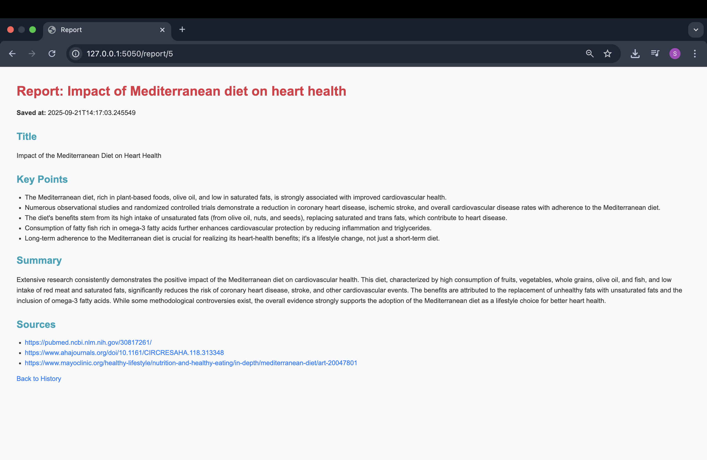
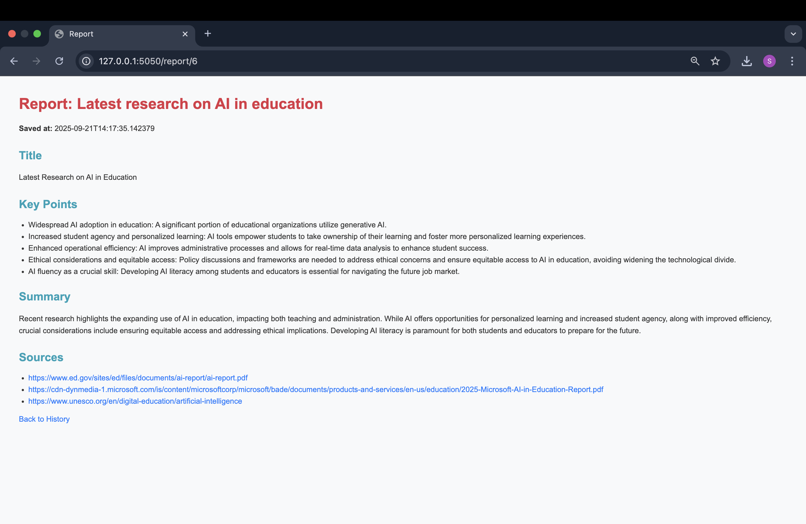
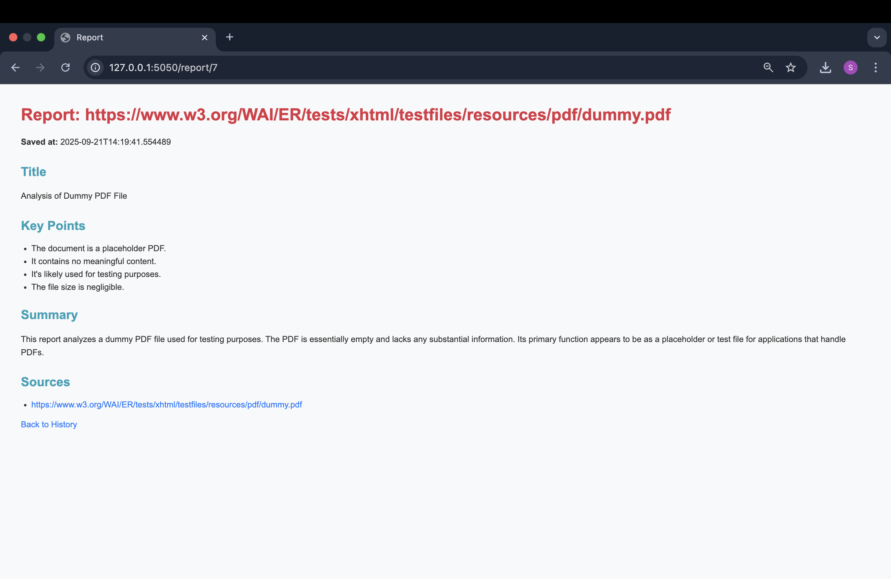
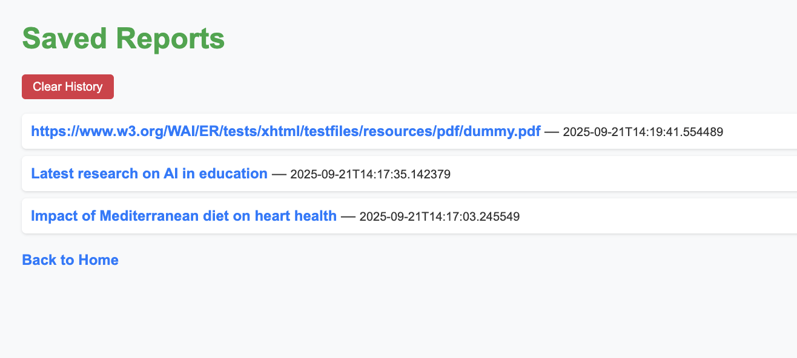
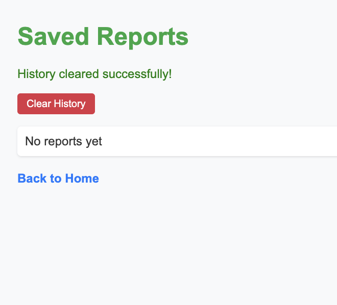

# AI Agent

This project is an **AI-powered research assistant** that fetches online sources, extracts content (HTML/PDF), summarizes it using a large language model (Google Gemini), and saves structured reports in a database. Users can view past reports through a simple web interface.

---

## Features

- **Query the AI agent**: Ask about any topic, e.g., `"Impact of Mediterranean diet on heart health"`.
- **Web search**: Uses SerpAPI to find 2–3 relevant online sources.
- **Content extraction**: Extracts text from:
  - HTML pages using `trafilatura`
  - PDF files using `pypdf`
- **LLM-based summarization**: Generates structured summaries with:
  - **Title**  
  - **Key points** (3–6 bullets)  
  - **Short summary** (2–3 sentences)  
  - **List of source URLs**
- **Database storage**: Reports saved in SQLite for later retrieval.
- **Web interface**:  
  - Home page to enter queries  
  - History page to see past reports  
  - Report page to view structured summary  
  - Clear history functionality
- **Error handling**: Gracefully handles blocked pages, fetch errors, and unsupported content types.

---
## Technology Used & Choice Rationale

- **Python** – Main backend language for flexibility, easy API integration, and fast prototyping.  
- **Flask** – Lightweight web framework to build the web interface (home, history, report pages) quickly and efficiently.  
- **SerpAPI** – Chosen for web search because it provides structured search results from Google reliably without scraping, reducing the chance of blocked requests.  
- **trafilatura** – HTML content extraction library; extracts clean, meaningful text while removing boilerplate from web pages.  
- **pypdf** – PDF parsing library; reliable for extracting text directly from PDFs without converting them to images.  
- **Google Gemini API** – LLM used to summarize multiple sources into structured reports; chosen for concise summaries and bullet point generation.  
- **SQLite** – Lightweight database to store past reports; simple to set up and integrates easily with Python.  
- **HTML + Jinja2 templates** – Frontend for rendering dynamic content on home, history, and report pages without a heavy frontend framework.  

**Why these choices:**  
This combination ensures the agent can fetch and extract content from both web pages and PDFs reliably. Python + Flask keeps the system lightweight and maintainable. Gemini ensures high-quality summaries. SQLite provides persistent memory for the agent’s reports, making the project self-contained and easy to run locally.

---

## Setup & Installation

1. **Clone the repository**
    ```bash
    git clone https://github.com/sandalinatekarr/ai-agent.git
    cd ai-agent
    ```

2. **Create and activate a virtual environment**
    ```bash
    python3 -m venv venv
    source venv/bin/activate  # Mac/Linux
    venv\Scripts\activate     # Windows
    ```

3. **Install dependencies**
    ```bash
    pip install -r requirements.txt
    ```

4. **Set environment variables**
    ```bash
    export SERPAPI_API_KEY="your_serpapi_key"
    export GOOGLE_API_KEY="your_google_gemini_key"
    ```

5. **Run the app**
    ```bash
    python app.py
    ```

6. **Open in browser**
    ```
    http://127.0.0.1:5050
    ```

---

## Example Queries

1. **Impact of Mediterranean diet on heart health**  
   

2. **Latest AI research in education**  
   

3. **Dummy PDF extraction**  
   

---

## History Page

- **Saved Reports / History**  
  

- **Clear History Button**  
  

---

## Demo

**Google Drive Link**: [Demo Video](https://drive.google.com/file/d/1dbZrXH0aljAseATpTnVZT3ewFlpb9Ntl/view?usp=sharing)

---

## Notes

- Supports both HTML and PDF extraction.  
- Sources that cannot be fetched are skipped with a warning.  
- History can be cleared from the web interface.  

---

## License

MIT License


